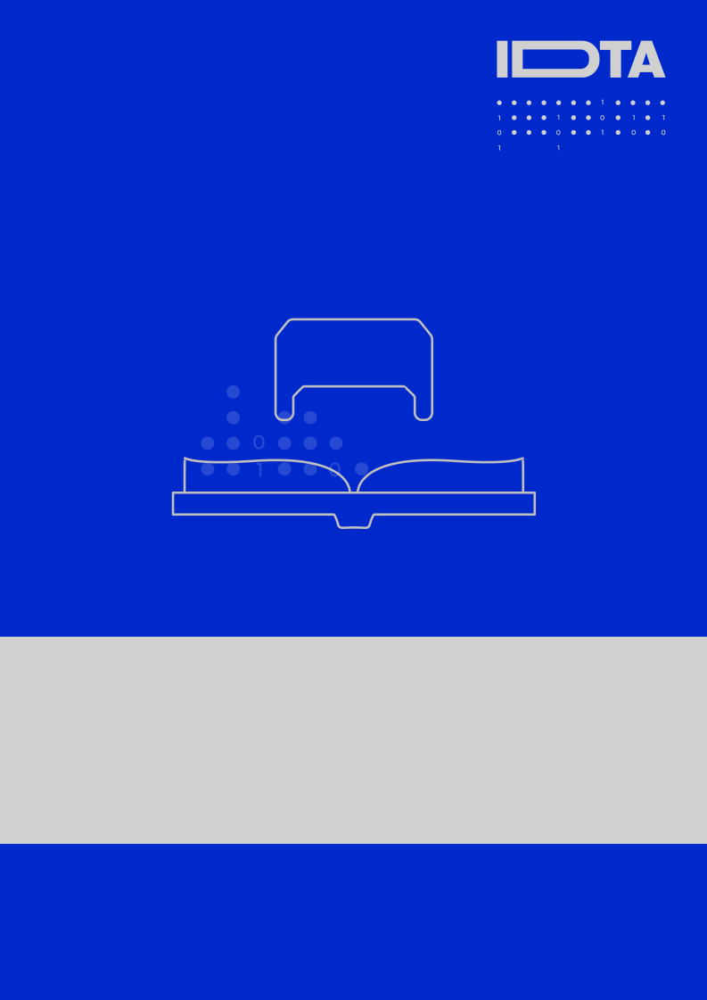
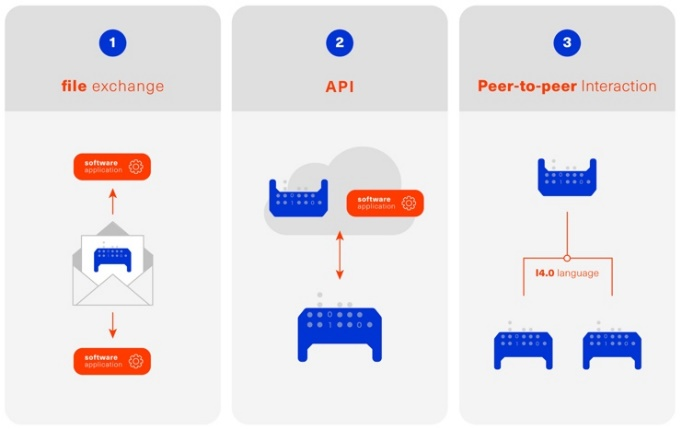
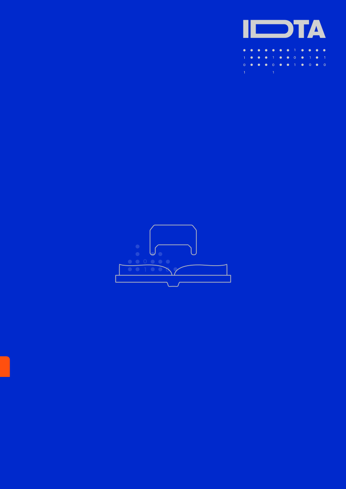

= Asset Administration Shell Reading Guide

== Aim of this Document

Over the course of the last years IDTA and related organizations have published numerous papers concerning the Asset Administration Shell. This document acts as a guide by recommending selected "must-read" documents for different reader groups and will be updated regularly.

== Goals of Industrie 4.0

Industrie 4.0 (I4.0) refers to the intelligent networking of machines and processes for industry with the help of information and communication technology. Today’s rigid and strictly defined value chains are replaced by flexible, highly dynamic and globally connected value networks with new forms of cooperation. The Asset Administration Shell helps implement Digital Twins for I4.0 and creates interoperability across the solutions of different suppliers.

== Asset Administration Shell in a Nutshell

The Asset Administration Shell (AAS) is the digital representation of an asset. The AAS consists of a number of Submodels in which all the information and functionalities of a given asset – including its features, characteristics, properties, statuses, parameters, measurement data, and capabilities – can be described. It allows for the use of different communication channels and applications and serves as the link between objects and the connected, digital, and distributed world.

The structure of the AAS is defined via a technology-independent metamodel and several technology-specific serialization mappings such as XML, JSON, or RDF. Its contents are defined via domain- or application-specific Submodel templates.

The interaction with the AAS can follow different patterns, which have different technical requirements, i.e., file exchange, server-client, and peer-to-peer interaction.

Figure 1: AAS interaction patterns

== Recommended Documents

For this reading guide, the documents have been sorted by interest groups rather than topics. In some cases, only specific pages or sections are recommended reading material.

Where to start: If you have never heard of the AAS

For the generally interested reader: If you want to learn more about the subject

For decision makers: If you are interested in the business side of I4.0

For software developers and architects: If you want to know how to create software for the AAS

For users of the AAS and domain experts: If you are interested in using the AAS for specific tasks

Security and AI: If you want to deep dive into these special topics.

== Where to Start

When completely new to the topic of I4.0 and the AAS, we highly recommend visiting the website of the Plattform Industrie 4.0[1]. Then start with the Two-Pager[2] and the presentation slides[3]. The first few slides of the Presentation[4] cover general AAS topics, while later slides introduce some advanced topics. All these should provide a brief and quick introduction to the topic in general. For a deep dive[5] gives a comprehensive overview of recent and current activities of Plattform I4.0.

== Tools, Examples, and Prototypes

The website https://github.com/eclipse-aaspe/aaspe contains the latest version of the AASX package explorer, which can be used to create, edit, and view AAS file serializations (*.aasx). The site https://github.com/admin-shell-io includes the AASX-server as code, binaries, or pre-built Docker images, making AASX packages accessible via standardized APIs.

The Eclipse Digital Twin Top-Level Project, found at https://projects.eclipse.org/projects/dt, is a collaborative, open-source initiative at the Eclipse Foundation fostering the development of reference implementations for the AAS activities driven by the IDTA. Eclipse BaSyx (https://eclipse.dev/basyx/) is an open-source AAS middleware. https://admin-shell-io.com/ provides various tools and examples including a running AAS server with a web interface and AAS for exemplary products. However, not all examples have been updated to v3.0 of the AAS specification, yet.

== References

[arabic]
. „What is Industrie 4.0?”: https://bit.ly/3kaRz2N.
. „The Asset Administration Shell: Implementing digital twins for use in Industrie 4.0, A starter kit for developers”, 12/2019: https://bit.ly/3kZZSPl.
. „The digital twin in Industrie 4.0 - A short introduction to properties, submodels & Asset Administration Shells (AAS)”, 05/2021: https://bit.ly/32FVdOf.
. „Details of the Administration Shell - from idea to implementation”, 07/2019: https://bit.ly/2H8c2Hn.
. "Fortschrittsbericht 2023. Industrie 4.0: Auf dem Weg zur intelligent vernetzten Industrie." (German only), 07/2023: https://bit.ly/3MfKrCi.

